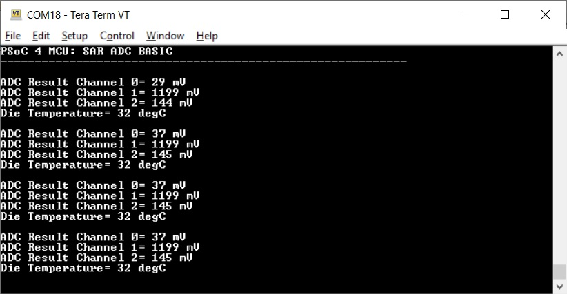
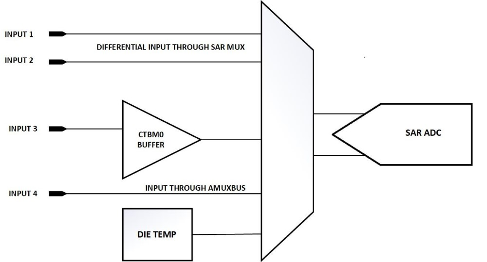
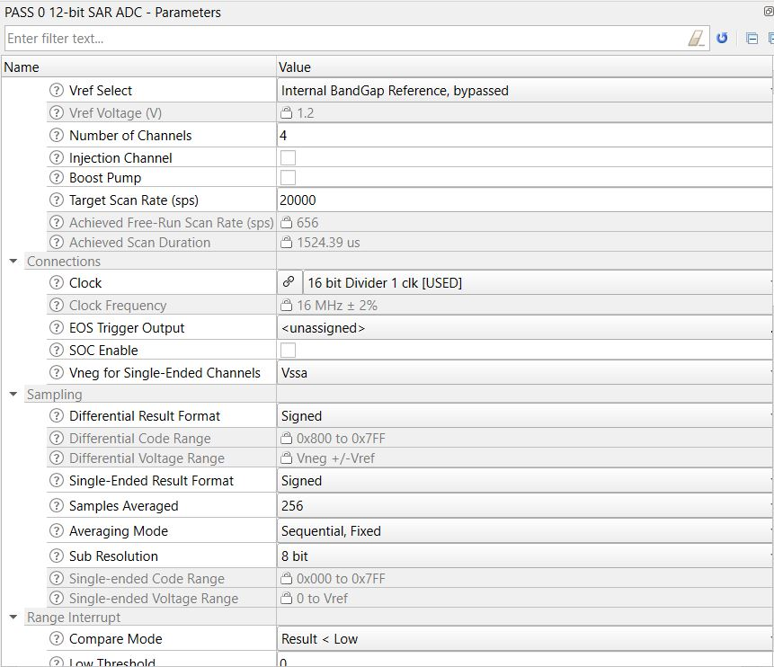
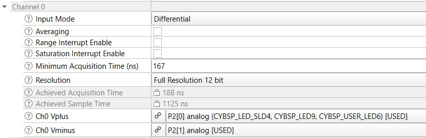
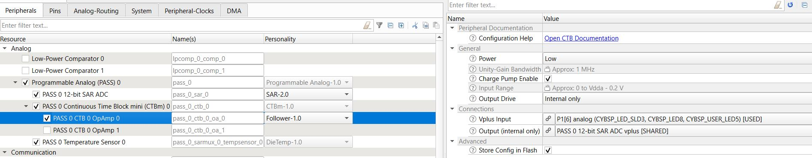
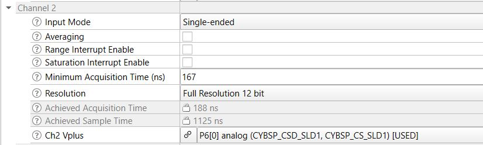
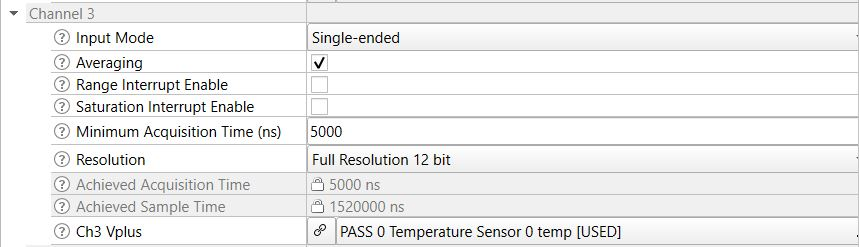

# PSoC&trade; 4 MCU: SAR ADC

This example demonstrates the use of a SAR ADC resource of PSoC&trade; 4 MCU. The ADC is configured to measure inputs from different sources and display results through a UART terminal.

[View this README on GitHub.](https://github.com/Infineon/mtb-example-psoc4-sar-adc)

[Provide feedback on this code example.](https://cypress.co1.qualtrics.com/jfe/form/SV_1NTns53sK2yiljn?Q_EED=eyJVbmlxdWUgRG9jIElkIjoiQ0UyMzQwNDAiLCJTcGVjIE51bWJlciI6IjAwMi0zNDA0MCIsIkRvYyBUaXRsZSI6IlBTb0MmdHJhZGU7IDQgTUNVOiBTQVIgQURDIiwicmlkIjoidnNycyIsIkRvYyB2ZXJzaW9uIjoiMS4wLjAiLCJEb2MgTGFuZ3VhZ2UiOiJFbmdsaXNoIiwiRG9jIERpdmlzaW9uIjoiTUNEIiwiRG9jIEJVIjoiSUNXIiwiRG9jIEZhbWlseSI6IlBTT0MifQ==)

## Requirements

- [ModusToolbox&trade; software](https://www.cypress.com/products/modustoolbox-software-environment) v2.4 or later

    **Note:** This code example version requires ModusToolbox&trade; software version 2.4 or later and is not backward compatible with v2.3 or older versions.
- Board support package (BSP) minimum required version: 2.0.0
- Programming language: C
- Associated parts:[PSoC&trade; 4100S](https://www.cypress.com/documentation/datasheets/psoc-4-psoc-4100s-family-datasheet-programmable-system-chip-psoc) , [PSoC&trade; 4100S plus](https://www.cypress.com/documentation/datasheets/psoc-4-psoc-4100s-plus-datasheet-programmable-system-chip-psoc) , [PSoC&trade; 4500S](https://www.cypress.com/documentation/datasheets/psoc-4-psoc-4500s-datasheet-programmable-system-chip-psoc), and [PSoC&trade; 4100S max](https://www.cypress.com/documentation/datasheets/psoc-4-psoc-4100s-max-datasheet-programmable-system-chip-psoc)


## Supported toolchains (make variable 'TOOLCHAIN')

- GNU Arm® embedded compiler v10.3.1 (`GCC_ARM`) - Default value of `TOOLCHAIN`
- Arm&reg; compiler v6.13 (`ARM`)
- IAR C/C++ compiler v8.42.2 (`IAR`)


## Supported kits (make variable 'TARGET')

- [PSoC&trade; 4100S max pioneer kit](https://www.cypress.com/CY8CKIT-041s-max) (`CY8CKIT-041S-MAX`) - Default value of `TARGET`
- [PSoC&trade; 4100S plus prototyping kit](https://www.cypress.com/CY8CKIT-149) (`CY8CKIT-149`)
- [PSoC&trade; 4100S CAPSENSE&trade; pioneer kit](https://www.cypress.com/CY8CKIT-041-41xx) (`CY8CKIT-041-41XX`)
- [PSoC&trade; 4500S pioneer kit](https://www.cypress.com/CY8CKIT-045S) (`CY8CKIT-045S`)


## Hardware setup

This example uses the board's default configuration. See the kit user guide to ensure that the board is configured correctly.

This code example requires 3 analog inputs connected to the ADC. Connect a differential input to Input1 and Input2. Input3 and Input 4 are singled ended inputs.

Pin assignments for ADC inputs for supported kits are as follows:

**Table 1. ADC input signals**

| Development kit | Input1 | Input2 | Input3 | Input4 |
| - | - | - | - | - |
| CY8CKIT-149      | 2[0] | 2[1] | 1[6] | 6[0] |
| CY8CKIT-041-41XX | 2[0] | 2[1] | 1[5] | 0[0] |
| CY8CKIT-045S     | 2[2] | 2[3] | 1[5] | 6[1] |
| CY8CKIT-041S-MAX | 2[0] | 2[1] | 1[6] | 6[0] |


**Note:** The PSoC&trade; 4 kits ship with KitProg2 installed. The ModusToolbox&trade; software requires KitProg3. Before using this code example, make sure that the board is upgraded to KitProg3. The tool and instructions are available in the [firmware loader](https://github.com/Infineon/Firmware-loader) GitHub repository. If you do not upgrade, you will see an error like "unable to find CMSIS-DAP device" or "KitProg firmware is out of date".


## Software setup

Install a terminal emulator if you don't have one. Instructions in this document use [Tera Term](https://ttssh2.osdn.jp/index.html.en).


## Using the code example

Create the project and open it using one of the following:

<details><summary><b>In Eclipse IDE for ModusToolbox&trade; software</b></summary>

1. Click the **New application** link in the **quick panel** (or, use **File** > **New** > **ModusToolbox&trade; application**). This launches the [project creator](https://www.cypress.com/ModusToolboxProjectCreator) tool.

2. Pick a kit supported by the code example from the list shown in the **Project creator - Choose board support package (BSP)** dialog.

   When you select a supported kit, the example is reconfigured automatically to work with the kit. To work with a different supported kit later, use the [library manager](https://www.cypress.com/ModusToolboxLibraryManager) to choose the BSP for the supported kit. You can use the library manager to select or update the BSP and firmware libraries used in this application. To access the library manager, click the link from the **quick panel**.

   You can also just start the application creation process again and select a different kit.

   If you want to use the application for a kit not listed here, you may need to update the source files. If the kit does not have the required resources, the application may not work.

3. In the **Project creator - Select application** dialog, choose the example by enabling the checkbox.

4. (Optional) Change the suggested **New application name**.

5. The **Application(s) root path** defaults to the Eclipse workspace which is usually the desired location for the application. If you want to store the application in a different location, you can change the *Application(s) root path* value. Applications that share libraries should be in the same root path.

6. Click **Create** to complete the application creation process.

For more details, see the [Eclipse IDE for ModusToolbox&trade; software user guide](https://www.cypress.com/MTBEclipseIDEUserGuide) (locally available at *{ModusToolbox&trade; software install directory}/ide_{version}/docs/mt_ide_user_guide.pdf*).

</details>

<details><summary><b>In command-line interface (CLI)</b></summary>

ModusToolbox&trade; software provides the project creator as both a GUI tool and the command line tool, "project-creator-cli". The CLI tool can be used to create applications from a CLI terminal or from within batch files or shell scripts. This tool is available in the *{ModusToolbox&trade; software install directory}/tools_{version}/project-creator/* directory.

Use a CLI terminal to invoke the "project-creator-cli" tool. On Windows, use the command line "modus-shell" program provided in the ModusToolbox&trade; software installation instead of a standard Windows command-line application. This shell provides access to all ModusToolbox&trade; software tools. You can access it by typing `modus-shell` in the search box in the Windows menu. In Linux and macOS, you can use any terminal application.

This tool has the following arguments:

Argument | Description | Required/optional
---------|-------------|-----------
`--board-id` | Defined in the `<id>` field of the [BSP](https://github.com/Infineon?q=bsp-manifest&type=&language=&sort=) manifest | Required
`--app-id`   | Defined in the `<id>` field of the [CE](https://github.com/Infineon?q=ce-manifest&type=&language=&sort=) manifest | Required
`--target-dir`| Specify the directory in which the application is to be created if you prefer not to use the default current working directory | Optional
`--user-app-name`| Specify the name of the application if you prefer to have a name other than the example's default name | Optional

<br>

The following example will clone a "SAR ADC" application with the desired name "MySARADC" configured for the *CY8CKIT-041S-MAX* BSP into the specified working directory, *C:/mtb_projects*:

   ```
   project-creator-cli --board-id CY8CKIT-041S-MAX --app-id mtb-example-psoc4-sar-adc --user-app-name MySARADC --target-dir "C:/mtb_projects"
   ```

**Note:** The project-creator-cli tool uses the `git clone` and `make getlibs` commands to fetch the repository and import the required libraries. For details, see the "Project creator tools" section of the [ModusToolbox&trade; software user guide](https://www.cypress.com/ModusToolboxUserGuide) (locally available at *{ModusToolbox&trade; software install directory}/docs_{version}/mtb_user_guide.pdf*).

</details>

<details><summary><b>In third-party IDEs</b></summary>

Use one of the following options:

- **Use the standalone pProject creator](https://www.cypress.com/ModusToolboxProjectCreator) tool:**

   1. Launch the project creator from the Windows Start menu or from *{ModusToolbox&trade; software install directory}/tools_{version}/project-creator/project-creator.exe*.

   2. In the initial **Choose board support package** screen, select the BSP, and click **Next**.

   3. In the **Select application** screen, select the appropriate IDE from the **Target IDE** drop-down menu.

   4. Click **Create** and follow the instructions printed in the bottom pane to import or open the exported project in the respective IDE.

- **Use command-line interface (CLI):**

   1. Follow the instructions from the **In command-line interface (CLI)** section to create the application, and then import the libraries using the `make getlibs` command.

   2. Export the application to a supported IDE using the `make <ide>` command.

   3. Follow the instructions displayed in the terminal to create or import the application as an IDE project.

For a list of supported IDEs and more details, see the "Exporting to IDEs" section of the [ModusToolbox&trade; software user guide](https://www.cypress.com/ModusToolboxUserGuide) (locally available at *{ModusToolbox&trade; software install directory}/docs_{version}/mtb_user_guide.pdf*).

</details>

## Operation

1. Connect the inputs to the ADC using instructions in the [Hardware setup](#hardware-setup) section.

2. Connect the kit to your PC using the provided USB cable through the KitProg3 USB connector.

3. Program the board with the SAR ADC code.

   <details><summary><b>Using Eclipse IDE for ModusToolbox&trade; software</b></summary>

      1. Select the application project in the project explorer.

      2. In the **quick panel**, scroll down, and click **\<Application name> program (KitProg3_MiniProg4)**.
   </details>

   <details><summary><b>Using CLI</b></summary>

     From the terminal, execute the `make program` command to build and program the application using the default toolchain to the default target. The default toolchain and target are specified in the application's Makefile but you can override those values manually:
      ```
      make program TARGET=<BSP> TOOLCHAIN=<toolchain>
      ```

      Example:
      ```
      make program TARGET=CY8CKIT-041S-MAX TOOLCHAIN=GCC_ARM
      ```
   </details>

4. Open a terminal on the connected system with 115200 baud rate with 8-N-1 configuration.

ADC channel outputs and the temperature output from the internal die temperature sensor are available on the terminal.

   **Figure 1. Output on UART terminal**

   


## Debugging

You can debug the example to step through the code. In the IDE, use the **\<Application name> debug (KitProg3_MiniProg4)** configuration in the **quick panel**. For more details, see the "Program and debug" section in the [Eclipse IDE for ModusToolbox&trade; software user guide](https://www.cypress.com/MTBEclipseIDEUserGuide).


## Design and implementation

### ADC configuration

This example shows how an ADC can be configured using the device configurator and how different types of inputs are connected to ADC channels.

**Figure 2. Inputs connected to the ADC**



The ADC uses an internal band-gap reference in bypass mode as the voltage reference. Four channels are converted in each conversion cycle. A 12MHz clock is used as the clock source.

**Figure 2. Basic ADC configuration**



ADC channel 0 is configured in differential mode. Input1 and Input2 act as the differential terminals for channel0. These inputs are routed through the SAR Mux resource of the device.

**Figure 3. ADC Channel 0 configuration**




ADC channel 1 is configured in single-ended mode. Input3 to channel1 is buffered through CTMB0 configured in follower mode.

**Figure 4. CTBM0 configuration**




ADC channel 2 is configured in single-ended mode. Input4 to this channel is routed through the AMUXBUS resource of the device.

**Figure 5. ADC Channel 2 configuration**




Finally, ADC channel 3 is configured in single-ended mode. This channel converts the Die Temperature block input. The ADC PDL provides the API to convert the count value to degree celsius.

For accurate temperature conversion, averaging (256 samples) is enabled; the acquisition time is 5 us for this channel.

**Figure 6. ADC Channel 3 configuration**



The actual pins used for each channel depend on the device family selected. See Table 1 for more details.


### Resources and settings

In this code example, the PSoC&trade; 4 SAR ADC gets input different analog inputs and converts them to digital counts.

**Table 2. Application resources**

| Resource  |  Alias/object     |    Purpose     |
| :------- | :------------    | :------------ |
| SAR (ADC) (PDL) |SAR0          | ADC to convert analog input to digital|
| Opamp (CTBm) (PDL) |CTBM0          | Opamp follower to buffer an input|

<br>


## Related resources

Resources  | Links
-----------|----------------------------------
Application notes  | [AN79953](https://www.cypress.com/AN79953) – Getting started with PSoC&trade; 4
Code examples  | [Using ModusToolbox&trade; software](https://github.com/Infineon/Code-Examples-for-ModusToolbox-Software) on GitHub <br> [Using PSoC&trade; Creator](https://www.cypress.com/documentation/code-examples/psoc-345-code-examples)
Device documentation | [PSoC&trade; 4 datasheets](https://www.cypress.com/search/all/PSOC%204%20datasheets?sort_by=search_api_relevance&f%5B0%5D=meta_type%3Atechnical_documents) <br>[PSoC&trade; 4 technical reference manuals](https://www.cypress.com/search/all/PSoC%204%20Technical%20Reference%20Manual?sort_by=search_api_relevance&f%5B0%5D=meta_type%3Atechnical_documents)
Development kits | Visit www.cypress.com/microcontrollers-mcus-kits and use the options in the **Select your kit** section to filter kits by *Product family* or *Features*.
Libraries on GitHub  | [mtb-pdl-cat2](https://github.com/Infineon/mtb-pdl-cat2) – PSoC&trade; 4 peripheral driver library (PDL) <br>  [mtb-hal-cat2](https://github.com/Infineon/mtb-hal-cat2) – Hardware abstraction layer (HAL) library
Middleware on GitHub  | [capsense](https://github.com/infineon/capsense) – CAPSENSE&trade; library and documents
Tools  | [Eclipse IDE for ModusToolbox&trade; software](https://www.cypress.com/modustoolbox) – ModusToolbox&trade; software is a collection of easy-to-use software and tools enabling rapid development with Infineon MCUs, covering applications from embedded sense and control to wireless and cloud-connected systems using AIROC&trade; Wi-Fi and Bluetooth® connectivity devices. <br> [PSoC&trade; Creator](https://www.cypress.com/products/psoc-creator-integrated-design-environment-ide) – IDE for PSoC&trade; and FM0+ MCU development <br> [PSoC&trade; programmer](https://www.cypress.com/products/psoc-programming-solutions) – A complete package that installs all components required for a programming and debug solution. In addition, it also installs the clock programmer and the bridge control panel.

<br>

## Other resources

Cypress provides a wealth of data at www.cypress.com to help you select the right device, and quickly and effectively integrate it into your design.

## Document history

Document title: *CE234040* – *PSoC&trade; 4 MCU: SAR ADC*

| Version | Description of change |
| ------- | --------------------- |
| 1.0.0   | New code example      |

<br>

All other trademarks or registered trademarks referenced herein are the property of their respective owners.

-------------------------------------------------------------------------------

© Cypress Semiconductor Corporation, 2021. This document is the property of Cypress Semiconductor Corporation, an Infineon Technologies company, and its affiliates ("Cypress").  This document, including any software or firmware included or referenced in this document ("Software"), is owned by Cypress under the intellectual property laws and treaties of the United States and other countries worldwide.  Cypress reserves all rights under such laws and treaties and does not, except as specifically stated in this paragraph, grant any license under its patents, copyrights, trademarks, or other intellectual property rights.  If the Software is not accompanied by a license agreement and you do not otherwise have a written agreement with Cypress governing the use of the Software, then Cypress hereby grants you a personal, non-exclusive, nontransferable license (without the right to sublicense) (1) under its copyright rights in the Software (a) for Software provided in source code form, to modify and reproduce the Software solely for use with Cypress hardware products, only internally within your organization, and (b) to distribute the Software in binary code form externally to end users (either directly or indirectly through resellers and distributors), solely for use on Cypress hardware product units, and (2) under those claims of Cypress’s patents that are infringed by the Software (as provided by Cypress, unmodified) to make, use, distribute, and import the Software solely for use with Cypress hardware products.  Any other use, reproduction, modification, translation, or compilation of the Software is prohibited.
<br>
TO THE EXTENT PERMITTED BY APPLICABLE LAW, CYPRESS MAKES NO WARRANTY OF ANY KIND, EXPRESS OR IMPLIED, WITH REGARD TO THIS DOCUMENT OR ANY SOFTWARE OR ACCOMPANYING HARDWARE, INCLUDING, BUT NOT LIMITED TO, THE IMPLIED WARRANTIES OF MERCHANTABILITY AND FITNESS FOR A PARTICULAR PURPOSE.  No computing device can be absolutely secure.  Therefore, despite security measures implemented in Cypress hardware or software products, Cypress shall have no liability arising out of any security breach, such as unauthorized access to or use of a Cypress product. CYPRESS DOES NOT REPRESENT, WARRANT, OR GUARANTEE THAT CYPRESS PRODUCTS, OR SYSTEMS CREATED USING CYPRESS PRODUCTS, WILL BE FREE FROM CORRUPTION, ATTACK, VIRUSES, INTERFERENCE, HACKING, DATA LOSS OR THEFT, OR OTHER SECURITY INTRUSION (collectively, "Security Breach").  Cypress disclaims any liability relating to any Security Breach, and you shall and hereby do release Cypress from any claim, damage, or other liability arising from any Security Breach.  In addition, the products described in these materials may contain design defects or errors known as errata which may cause the product to deviate from published specifications. To the extent permitted by applicable law, Cypress reserves the right to make changes to this document without further notice. Cypress does not assume any liability arising out of the application or use of any product or circuit described in this document. Any information provided in this document, including any sample design information or programming code, is provided only for reference purposes.  It is the responsibility of the user of this document to properly design, program, and test the functionality and safety of any application made of this information and any resulting product.  "High-Risk Device" means any device or system whose failure could cause personal injury, death, or property damage.  Examples of High-Risk Devices are weapons, nuclear installations, surgical implants, and other medical devices.  "Critical Component" means any component of a High-Risk Device whose failure to perform can be reasonably expected to cause, directly or indirectly, the failure of the High-Risk Device, or to affect its safety or effectiveness.  Cypress is not liable, in whole or in part, and you shall and hereby do release Cypress from any claim, damage, or other liability arising from any use of a Cypress product as a Critical Component in a High-Risk Device. You shall indemnify and hold Cypress, including its affiliates, and its directors, officers, employees, agents, distributors, and assigns harmless from and against all claims, costs, damages, and expenses, arising out of any claim, including claims for product liability, personal injury or death, or property damage arising from any use of a Cypress product as a Critical Component in a High-Risk Device. Cypress products are not intended or authorized for use as a Critical Component in any High-Risk Device except to the limited extent that (i) Cypress’s published data sheet for the product explicitly states Cypress has qualified the product for use in a specific High-Risk Device, or (ii) Cypress has given you advance written authorization to use the product as a Critical Component in the specific High-Risk Device and you have signed a separate indemnification agreement.
<br>
Cypress, the Cypress logo, and combinations thereof, WICED, ModusToolbox, PSoC, CapSense, EZ-USB, F-RAM, and Traveo are trademarks or registered trademarks of Cypress or a subsidiary of Cypress in the United States or in other countries. For a more complete list of Cypress trademarks, visit cypress.com. Other names and brands may be claimed as property of their respective owners.
